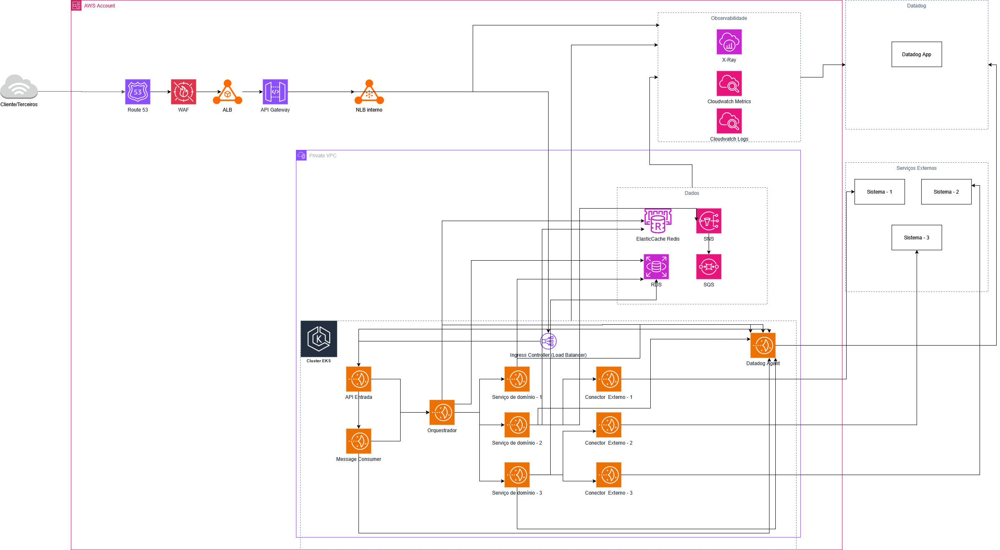

# Desafio Arquitetura Hub Conexão

## Desafio

📌 Contexto
 
Sua missão é propor uma arquitetura para um sistema que atua como hub de integração entre sistemas terceiros, realizando:
 
· Recebimento de requisições externas (via APIs ou mensagens);
 
· Processamento interno com regras de negócio;
 
· Envio de dados para outros sistemas;
 
· Gerenciamento de estados e workflow das requisições.
 
Este sistema será responsável por garantir resiliência, rastreabilidade, observabilidade e escalabilidade.
 
🎯 Objetivo do desafio
 
Você deve propor uma arquitetura que atenda aos requisitos funcionais e não funcionais descritos acima, considerando boas práticas modernas de desenvolvimento e operação de sistemas distribuídos.
 
A proposta deve conter:
 
· Diagrama de arquitetura (alto nível);
 
· Justificativas técnicas para as escolhas feitas;
 
· Estratégias para garantir estabilidade, rastreabilidade e segurança;
 
· Pontos de atenção e riscos identificados.

 
Todos os itens devem ser entregues em um arquivo pdf.
 
🧩 Requisitos não funcionais esperados
 
· Alta disponibilidade e tolerância a falhas;
 
· Observabilidade com logs estruturados e métricas;
 
· Escalabilidade horizontal;
 
· Segurança na comunicação entre sistemas;
 
· Facilidade de manutenção e evolução.

## Solução - AWS Cloud

Resolvi desevolver a arquitetura em um ambiente cloud e para isso escolhi a AWS, pois é um serviço de cloud resiliente e com alta disponibilidade.

### Desenho da Arquitetura

### Route 53

Essa peça na AWS é responsável por resolver o DNS. Caso o cliente queira chamar um DNS do nome https://acme.com, essa é a aplicação responsável por disponibilizar esse nome pra ele.

Isso faz com que o hub tenha apenas um único ponto de entrada, caso seja necessário trocar o ALB ou o API Gateway, basta apenas mexer no DNS.

### AWS Web Application Firewall (WAF)

Depois de resolver o DNS a requisição passará pelo WAF que é responsável por bloquear os ataques mais comuns, como no caso de SQL Injection, XSS, brute force, etc. Também é possível aplicar e configurar regras  como ip block/allow, rate-based rules, entre outros...

Isso trás uma camada de segurança a mais para o ambiente.

### ALB Externo

O Application Load Balancer externo vai garantir junto com o WAF uma segurança e disponibilidade maiores para o nosso ambiente, garantindo assim uma alta disponiblidade e um balanceador de carga antes de chegar nas aplicações.

### API Gateway

Responsável por gerir schemas e controlar todo o fluxo, como rate limiting, quotas, throttling, etc. Ele ainda controla nossa autenticaçõa e autorização, garantindo assim que apenas pessoas credenciadas e autorizadas, bem como aplicações possam utilizar nossos serviços. Além disso é responsável por fazer uma validação prévia dos schemas e também controlar o versionamento das rotas, garantindo assim que nossos clientes não serão impactados.

### VPC/Subnet/NLB Interno

Os serviços aqui acoplados rodam dentro de uma subnet privada, sendo assim eles não tem um IP público. Isso garante que ninguém possa conectar diretamente em algum POD ou banco de dados.

O NLB interno é responsável por rotear nosso tráfego TCP para o **Ingress Controller**. A vantagem aqui é garantir que nosso API Controller não tenha conhecimento dos POD's do cluster e sim apenas do nosso NLB que inclusive, será responsável por distribuir as conexões para o nosso **Ingress Controller**.

### EKS Cluster/Ingress Controller

Responsável por receber todo o tráfego direcionado a ele atráves do nosso NLB. Também faz o controle que é responsável por direcionar as requisições para os POD's saudáveis.

#### API Entrada

Essa aplicação é responsável por ser a entrada "lógica" das requisições HTTP provenientes do nosso API Gateway.

Sendo assim controla nossa validação de input, normalização do payload, propagação do correlationId (Identificador único de uma requição através dos microserviços), publicação na mensageria ou chamadas no orquestrador.

#### Message Consumer

Esse worker é responsável por gerenciar as mensagens que chegam atráves de fila/tópico e as transforma em comandos/eventos internos que serão enviados para nosso orquestrador.

Como ele é ligado também pela nossa API de entrada, permite a intregação síncrona e assíncrona.

#### Orquestrador

Essa peça é o cérebro de todo o nosso fluxo, ele controla tanto o fluxo de trabalho quanto o estado de cada requisição. A ideia de utilizar o orquestrador é deixar claro onde está o fluxo do negócio, bem como rastrear e versionar nosso fluxo de trabalho, o que facilita tanto testes como manutenção do processo.

#### Serviços de Dominios 

São aplicações responsáveis por conter as regras de negócios. Dessa forma é capaz de se isolar as regras de negócio tanto da parte de **orquestração** como da parte de **integração(Conector Externo)**. Graças ao desacoplamento feito, deixando apenas serviços de dominios, isso garante uma facilidade na hora da testabilidade.

#### Conectores Externos

Essas aplicações são responsáveis por fazer a comunicação com sistemas externos, sendo assim, podem efetuar autenticações, mapeamento de modelos internos para externos, garantiar resiliência com implementações de retries, timeout e circuit breakers e tratamento de resposta de erros especificos para cada sistema.

Como cada aplicação é resonsável por cuidar da integração com cada sistema externo, isso garante um impacto isolado em caso de queda de algum sistema externo, bem como fica fácil fazer a manutenção caso algum sistema mude o contrato.

### Dados

#### RDS

Responsável por garantir a persistência das informações, bem como garantir o estado das requisições/fluxo de trabalho, garante também um histórico de transições para questões de auditoria e as configurações de integrações.

#### Redis

A implementação do ElastiCache Redis aqui garantirá a idempotência das requições (status/resultado) bem como informações recorrentes de leituras e o contexto temporário do fluxo que será utilizado pelo orquestrador.

#### SQS/SNS

Esse conjunto de peças disponibiliza um pub/sub que é responsável por orquestrar os tópicos das filas e enviar para o message consumer bem como também disponibilizar para que nossa api de entrada ou orquestrador possa publicas comandos.

### Observabilidade AWS (Cloudwatch/X-Ray/DataDog)

Responsáveis por receber as métricas e logs das peças anteriores instrumentadas. O Datadog Agent é responsável por também receber todas essas informações e enviar diretamente o SaaS para disponibilização das informacões, bem como monitoramento e alertas em casos de quedas e infrações de regras previamente definidas.

## Pontos de atenção

Por mais que seja uma arquitetura robusta e totalmente desacoplada, ainda assim apresenta alguns riscos. 

### Complexidade

1. É uma arquitetura complexa que abrange dentro dela vários componentes, sendo assim, uma equipe pequena ou até mesmo imatura no que diz respeito a cloud/kubernetes pode apresentar dificuldades em lidar com incidentes em produção.
2. Curva de aprendizado para novos desenvolvedores entenderem o fluxo de ponta a ponta.
3. Caso não for bem configurada pode apresentar vários pontos de falha.

### Latência E2E

 1. Em uma arquitetura desse nível é necessário defirnir as prioridades dos fluxos que são necessários ser síncronos e os que não são necessário para evitar timeout e lentidão.

### RDS

1. O orquestrados e os serviços de dominio dependem fortemente do RDS, sendo assim, existe a possiblidade de bottlenecks, locks e I/O saturado em momentos de picos ou novas integrações.

### SQS/SNS

1. A utilização do SQS/SNS é excelente para desacoplar, no entanto, existe alguns problemas que podem ser chatos de lidar caso não seja configurado de forma correta, como *poison messages*, reprocessamento de mensagens e crescimento desgovernado da fila gerando uma latência enorme.

### Idempotência

1. Informações duplicadas em sistemas terceiros e até mesmo estado inconsistente no fluxo de trabalho caso o orquestrador não seja bem configurado.

### Versionamento/Contratos

1. Nesse nível de arquitetura existem muitos contratos, como por exemplo, API gateway, SQS, contrato com sistema terceiros, contrato entre serviços. Isso pode gerar quebra de contrato, tanto na entrada, quanto no pub/sub aonde o produtor e o consumidor estão em versões diferentes e também os conectores com contratos divergentes.

### Observabilidade

1. O rastreamento de informações é excelente tanto para encontrar um problema, tanto quanto para identificar possível latência em algum endpoint, no entanto, caso não haja controle poderá haver um custo elevado do Datadog.
2. Informações desestruturadas podem ocasionar em dificuldades para encontrar a causa raiz de problemas.

### Custo

1. Cada componente nessa arquitetura tem um custo base e ele aumenta conforme a utilização, sendo possível o custo escalar mais que o benefício do sistema.
2. Overengineering e dificuldade de justificativa da arquitetura caso o volume de transações for pequeno.

### LGPD

1. Por ser um sistema desacoplado, existe a possibilidade de aparecer dados sensíveis em lugares que não deveriam, como por exemplo, logs e traces.

### EKS

1. Caso o cluster EKS não seja bem configurado e definido, existe a possibilidade de faltar IP para novos pods em momentos de pico.
2. Problemas com *PodDisruptionBudget* em pods criticos.

### Aplicações de terceiros

1. Problemas de instabilidade, principalmente se o sistema terceiro fazer parte de um processo síncrono
2. Latência e throttling caso não seja adptado para escalabilidade.